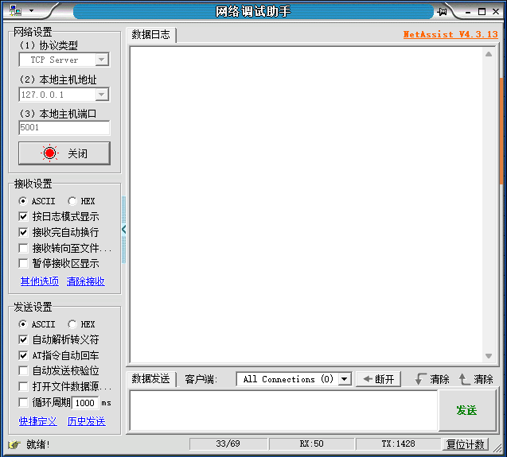
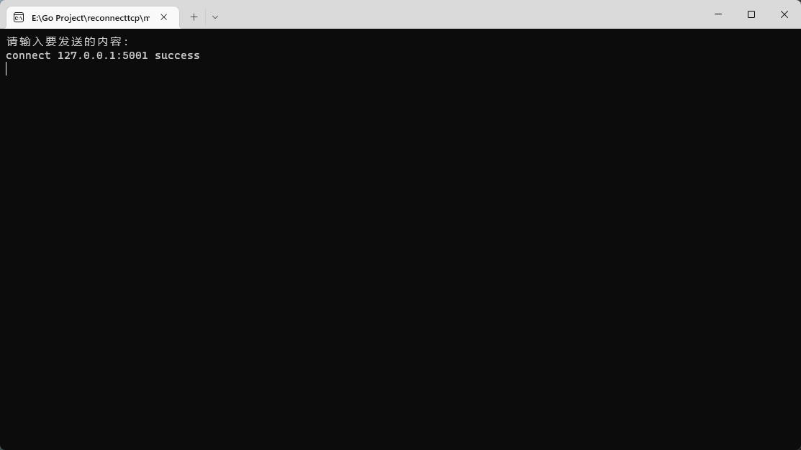
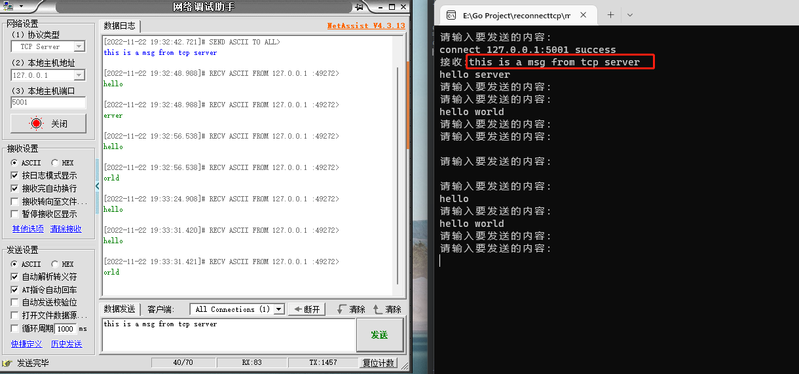
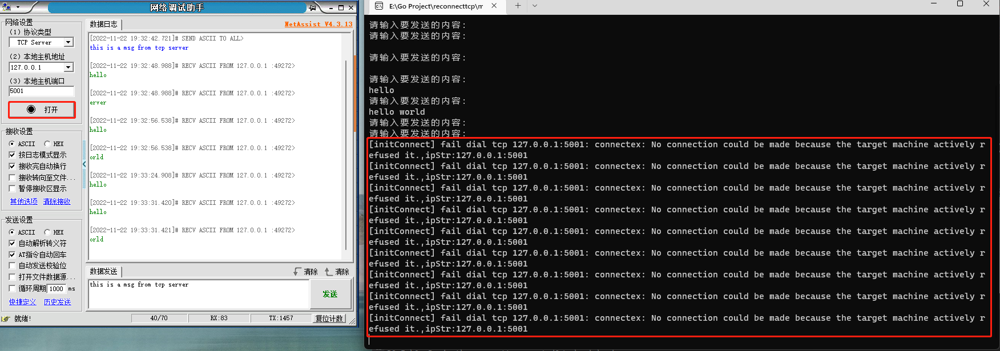
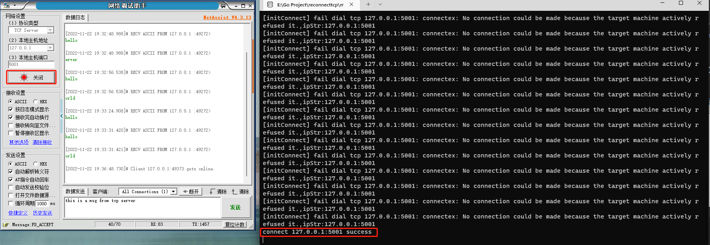
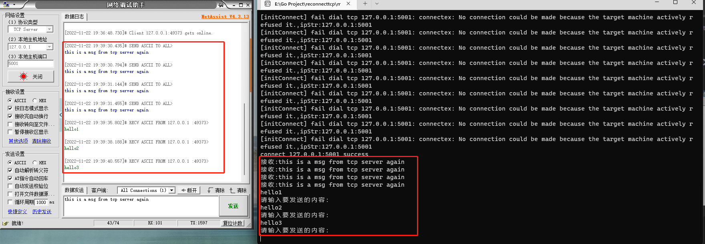
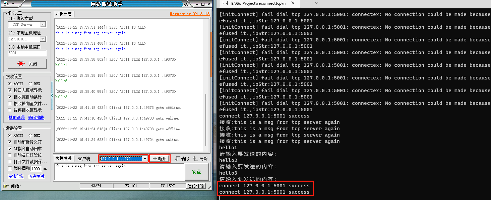

# reconnecttcp
as the name,the is a module that you just gei a ip string,it can help you connect server until you close it
it can auto reconnect any time,and read receive data anytime.
# useage
```go
package main

import (
	"fmt"
	"github.com/utils-go/reconnecttcp"
	"time"
)

func main() {
	addr := "127.0.0.1:5001"
	client := reconnecttcp.NewReconnectTcp(addr)
	go func() {
		for {
			data := client.Read()
			if data != nil {
				fmt.Printf("接收:%s\n", string(data))
			}
			time.Sleep(200 * time.Millisecond)
		}
	}()
	for {
		fmt.Println("请输入要发送的内容：")
		var str string
		fmt.Scanln(&str)
		client.Write([]byte(str))
	}
}

```
you can call `client.Close()` to stop reconnect action 
# test reconnect
#### start tcp server

#### start reconnect tcp

#### send message each other

#### close server
it prints many reconnect message:

#### open server
the tcp client auto connect immediately:

#### send message each other again

#### close client from server
when close the client's connection from server,the client can auto connect to server immadiately
